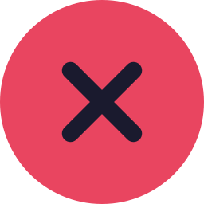
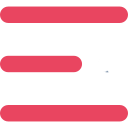

<head>
<meta name="viewport" content="width=device-width, initial-scale=1.0">
<link rel="preconnect" href="https://fonts.gstatic.com">
<link rel="stylesheet" href="hear.css" type="text/css">
<title>Özgül olmayan savunma mekanizmaları</title>
	<link rel="shortcut icon" href="/favicon.ico" type="image/x-icon" >
<link href="https://fonts.googleapis.com/css2?family=Roboto:wght@900&display=swap" rel="stylesheet">
</head>

<a href="kalpkategori.html">
Kalp
</a>
<a href="kankategori.html">
Kan
</a>
<a href="dolasimkategori.html">
Dolaşım
</a>
<a href="bagisiklikkategori.html">
Bağışıklık
</a>

<a href="index.html">

</a>

Özgül olmayan savunma mekanizmaları

Özgül olmayan savunma mekanizmaları fiziksel engeller, fagositler, doğal katil hücreler, interferonlar, iltihaplanmalar ve ateşlenmelerdir.

<a href="hakkında.html">

Hakkımızda

</a>
<a href="gizlilik.html">

Gizlilik politikası

</a>

©2021 Dolsis. Tüm hakları saklıdır.

	  
	  
	  

